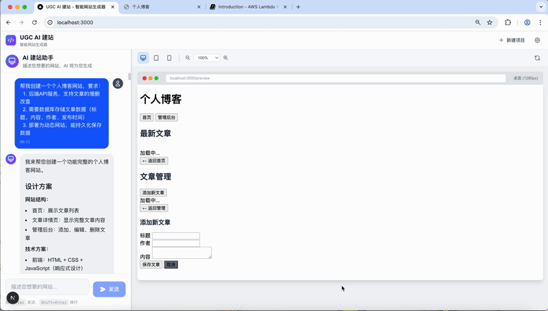

# UGC AI Demo - AI 驱动的网站生成与部署平台

基于 Amazon Bedrock AgentCore 构建的 AI 网站生成器，支持自然语言对话生成静态/动态网站并一键部署到 AWS。

## 功能特性

- **自然语言建站**: 通过对话描述需求，AI 自动生成完整网站代码
- **实时预览**: 生成代码后即时预览效果
- **智能部署决策**: AI 自动判断静态/动态部署方式
- **数据库支持**: 支持 DynamoDB、Aurora PostgreSQL、ElastiCache Redis
- **成本优化**: 使用 Model Router 智能选择模型，降低 90% 成本

## 演示

### 静态网站创建及部署


### 动态网站创建及部署



## 系统架构

```
┌─────────────────┐     ┌─────────────────┐
│    Frontend     │────▶│   ECS Backend   │
│   (Next.js)     │     │   (FastAPI)     │
└─────────────────┘     └────────┬────────┘
                                 │
                                 ▼
┌────────────────────────────────────────────────────────────────────────────────────────┐
│                            Amazon Bedrock AgentCore                                    │
│  ┌──────────────────────────────────────────────────────────────────────────────────┐  │
│  │                          AgentCore Runtime (MicroVM)                             │  │
│  │  ┌────────────────────────────────────────────────────────────────────────────┐  │  │
│  │  │                        Strands Agent (Python)                              │  │  │
│  │  │  ┌─────────────────────────────────────────────────────────────────────┐   │  │  │
│  │  │  │                    Agent Tools (@tool 装饰器)                        │   │  │  │
│  │  │  │  ┌─────────────┐ ┌─────────────┐ ┌─────────────┐ ┌─────────────┐    │   │  │  │
│  │  │  │  │generate_    │ │deploy_to_s3 │ │deploy_to_   │ │get_deploy_  │    │   │  │  │
│  │  │  │  │website_code │ │             │ │lambda       │ │ment_status  │    │   │  │  │
│  │  │  │  └─────────────┘ └─────────────┘ └─────────────┘ └─────────────┘    │   │  │  │
│  │  │  └─────────────────────────────────────────────────────────────────────┘   │  │  │
│  │  │                              │                                             │  │  │
│  │  │                    ┌─────────┴─────────┐                                   │  │  │
│  │  │                    ▼                   ▼                                   │  │  │
│  │  │            ┌──────────────┐    ┌──────────────┐                            │  │  │
│  │  │            │ Model Router │    │ Bedrock LLM  │                            │  │  │
│  │  │            │ Nova/Claude  │───▶│ Claude Sonnet│                            │  │  │
│  │  │            └──────────────┘    └──────────────┘                            │  │  │
│  │  └────────────────────────────────────────────────────────────────────────────┘  │  │
│  │                                     │ logs                                       │  │
│  └─────────────────────────────────────┼────────────────────────────────────────────┘  │
│                                        │                                               │
│         ┌──────────────────────────────┼──────────────────────────────┐                │
│         ▼                              │                              ▼                │
│  ┌─────────────────┐                   │                   ┌─────────────────┐         │
│  │ AgentCore       │                   │                   │ AgentCore       │         │
│  │ Browser Tool    │───────┐           │           ┌───────│ Code Interpreter│         │
│  │ (云端 Chromium) │       │           │           │       │ (代码执行沙箱)   │         │
│  └─────────────────┘       │           │           │       └─────────────────┘         │
│           │ logs           │           │           │               │ logs              │
│           └────────────────┼───────────┼───────────┼───────────────┘                   │
│                            ▼           ▼           ▼                                   │
│                    ┌─────────────────────────────────────┐                             │
│                    │         Amazon CloudWatch           │                             │
│                    │  /aws/bedrock-agentcore/runtimes/*  │                             │
│                    │  /aws/bedrock-agentcore/browsers/*  │                             │
│                    │  /aws/bedrock-agentcore/code-int/*  │                             │
│                    └─────────────────────────────────────┘                             │
│                                                                                        │
│  ┌─────────────────┐                                                                   │
│  │ AgentCore       │                                                                   │
│  │ Memory          │                                                                   │
│  │ (会话持久化)    │                                                                   │
│  └─────────────────┘                                                                   │
└────────────────────────────────────────────────────────────────────────────────────────┘
                                          │
         ┌────────────────────────────────┼────────────────────────────────┐
         ▼                                ▼                                ▼
┌─────────────────┐             ┌─────────────────┐             ┌─────────────────┐
│  S3+CloudFront  │             │ Lambda+WebAdapter│            │    Databases    │
│  (静态网站部署)  │             │  +API Gateway   │             │ DynamoDB/Aurora │
└─────────────────┘             │  (动态网站部署)  │             │ /ElastiCache    │
                                └─────────────────┘             └─────────────────┘
```

**架构说明:**
- **AgentCore Runtime**: 托管 Agent 的无服务器运行时环境（MicroVM），日志输出到 CloudWatch
- **Strands Agent**: Python Agent 框架，通过 `load_tools_from_directory` 自动加载工具
- **AgentCore Browser Tool**: 独立的云端浏览器服务，用于浏览参考网站、提取设计元素
- **AgentCore Code Interpreter**: 独立的代码执行沙箱，用于验证生成代码语法
- **AgentCore Memory**: 独立的会话持久化服务，支持跨会话记忆
- **CloudWatch Logs**: 集中收集 Runtime、Browser、Code Interpreter 的运行日志，便于调试和监控

**CloudWatch 日志组:**
```bash
# Runtime 日志（Agent 执行日志）
/aws/bedrock-agentcore/runtimes/<runtime-id>-DEFAULT

# Browser Tool 日志
/aws/bedrock-agentcore/browsers/<browser-id>

# Code Interpreter 日志
/aws/bedrock-agentcore/code-interpreters/<interpreter-id>

# 查看实时日志命令
aws logs tail /aws/bedrock-agentcore/runtimes/ugc_website_generator-xxx-DEFAULT --follow
```

### 使用的 AWS 服务

| 服务 | 用途 |
|------|------|
| Amazon Bedrock | Claude Sonnet 4 / Nova 2 模型调用 |
| Bedrock AgentCore | Agent Runtime 托管、Memory 持久化 |
| ECS Fargate | Backend API 服务托管 |
| Lambda + Web Adapter | 动态网站部署 |
| API Gateway HTTP API | Lambda 公网访问入口 |
| S3 + CloudFront | 静态网站托管与 CDN |
| DynamoDB | 动态网站数据存储 |
| Aurora PostgreSQL | 关系型数据库（博客、电商） |
| ElastiCache Redis | 缓存与实时数据 |
| ECR | 容器镜像仓库 |
| CodeBuild | AgentCore 部署构建 |

### Agent 工具列表

| 工具 | 文件 | 功能 |
|------|------|------|
| `generate_website_code` | `code_generator.py` | 生成网站代码 |
| `deploy_to_s3` | `deploy_tools.py` | 部署静态网站到 S3+CloudFront |
| `deploy_to_lambda` | `deploy_tools.py` | 部署动态应用到 Lambda |
| Browser | `browser_tool.py` | AgentCore 原生浏览器工具 |
| Code Interpreter | `code_interpreter.py` | AgentCore 代码执行工具 |

## 数据流 (UML 序列图)

```
┌──────┐     ┌───────┐     ┌───────────┐     ┌─────────────┐     ┌─────────┐
│ User │     │Frontend│    │ECS Backend│     │AgentCore    │     │AWS资源   │
└──┬───┘     └───┬───┘     └─────┬─────┘     │Runtime      │     └────┬────┘
   │             │               │           └──────┬──────┘          │
   │ 1.输入需求   │               │                  │                 │
   │────────────▶│               │                  │                 │
   │             │ 2.POST /chat  │                  │                 │
   │             │──────────────▶│                  │                 │
   │             │               │ 3.invoke()      │                 │
   │             │               │─────────────────▶│                 │
   │             │               │                  │ 4.调用LLM       │
   │             │               │                  │────────────────▶│
   │             │               │                  │◀────────────────│
   │             │               │                  │ 5.调用工具      │
   │             │               │                  │────────────────▶│
   │             │               │                  │◀────────────────│
   │             │               │◀─────────────────│                 │
   │             │◀──────────────│  6.返回代码      │                 │
   │ 7.显示预览   │               │                  │                 │
   │◀────────────│               │                  │                 │
   │             │               │                  │                 │
   │ 8.确认部署   │               │                  │                 │
   │────────────▶│               │                  │                 │
   │             │ 9.deploy      │                  │                 │
   │             │──────────────▶│─────────────────▶│                 │
   │             │               │                  │ 10.创建资源     │
   │             │               │                  │────────────────▶│
   │             │               │                  │  Lambda/S3/API  │
   │             │               │                  │◀────────────────│
   │             │◀──────────────│◀─────────────────│                 │
   │ 11.返回URL  │               │                  │                 │
   │◀────────────│               │                  │                 │
```

### 代码生成流程

1. **用户输入** → Frontend 发送 POST `/api/chat/stream`
2. **ECS Backend** → 构建 payload，调用 `AgentCoreClient.invoke_stream_async()`
3. **AgentCore Runtime** → Strands Agent 执行，调用 `generate_website_code` 工具
4. **Model Router** → 选择最优模型（Claude Sonnet 4 生成代码）
5. **代码提取** → `extract_code_from_result()` 从响应中提取代码文件
6. **返回前端** → SSE 流式返回，前端实时显示预览

## IAM 权限要求

### 1. AgentCore Runtime 执行角色

AgentCore Runtime 需要调用 Bedrock 模型和部署 AWS 资源：

```json
{
  "Version": "2012-10-17",
  "Statement": [
    {
      "Sid": "BedrockModelAccess",
      "Effect": "Allow",
      "Action": [
        "bedrock:InvokeModel",
        "bedrock:InvokeModelWithResponseStream"
      ],
      "Resource": "*"
    },
    {
      "Sid": "LambdaFullDeployment",
      "Effect": "Allow",
      "Action": ["lambda:*"],
      "Resource": "*"
    },
    {
      "Sid": "S3Deployment",
      "Effect": "Allow",
      "Action": [
        "s3:CreateBucket", "s3:DeleteBucket", "s3:PutObject", "s3:DeleteObject",
        "s3:PutBucketPolicy", "s3:DeleteBucketPolicy", "s3:PutBucketWebsite",
        "s3:PutPublicAccessBlock", "s3:ListBucket"
      ],
      "Resource": "*"
    },
    {
      "Sid": "CloudFrontAccess",
      "Effect": "Allow",
      "Action": ["cloudfront:*"],
      "Resource": "*"
    },
    {
      "Sid": "APIGatewayAccess",
      "Effect": "Allow",
      "Action": ["apigateway:*"],
      "Resource": "*"
    },
    {
      "Sid": "IAMRoleManagement",
      "Effect": "Allow",
      "Action": [
        "iam:CreateRole", "iam:DeleteRole", "iam:GetRole",
        "iam:AttachRolePolicy", "iam:DetachRolePolicy",
        "iam:PutRolePolicy", "iam:DeleteRolePolicy", "iam:PassRole"
      ],
      "Resource": "*"
    },
    {
      "Sid": "DynamoDBAccess",
      "Effect": "Allow",
      "Action": ["dynamodb:*"],
      "Resource": "*"
    },
    {
      "Sid": "EC2VPCAccess",
      "Effect": "Allow",
      "Action": [
        "ec2:DescribeSecurityGroups", "ec2:DescribeSubnets", "ec2:DescribeVpcs",
        "ec2:DescribeNetworkInterfaces", "ec2:DescribeVpcEndpoints",
        "ec2:CreateSecurityGroup", "ec2:DeleteSecurityGroup",
        "ec2:AuthorizeSecurityGroupEgress", "ec2:CreateNetworkInterface", "ec2:DeleteNetworkInterface"
      ],
      "Resource": "*"
    },
    {
      "Sid": "SecretsManagerAccess",
      "Effect": "Allow",
      "Action": ["secretsmanager:GetSecretValue"],
      "Resource": "arn:aws:secretsmanager:*:*:secret:ugc-*"
    },
    {
      "Sid": "STSAccess",
      "Effect": "Allow",
      "Action": ["sts:GetCallerIdentity"],
      "Resource": "*"
    }
  ]
}
```

### 2. ECS Task 执行角色

ECS Backend 需要调用 AgentCore Runtime API：

```json
{
  "Version": "2012-10-17",
  "Statement": [
    {
      "Sid": "AgentCoreInvoke",
      "Effect": "Allow",
      "Action": [
        "bedrock-agentcore:InvokeAgent",
        "bedrock-agentcore:InvokeAgentWithResponseStream"
      ],
      "Resource": "arn:aws:bedrock-agentcore:*:*:runtime/*"
    },
    {
      "Sid": "CloudWatchLogs",
      "Effect": "Allow",
      "Action": [
        "logs:CreateLogStream",
        "logs:PutLogEvents"
      ],
      "Resource": "arn:aws:logs:*:*:log-group:/ecs/*"
    },
    {
      "Sid": "ECRPull",
      "Effect": "Allow",
      "Action": [
        "ecr:GetDownloadUrlForLayer",
        "ecr:BatchGetImage",
        "ecr:GetAuthorizationToken"
      ],
      "Resource": "*"
    }
  ]
}
```

### 3. 动态部署 Lambda 执行角色

`deploy_to_lambda` 工具为每个部署创建的 Lambda 角色权限：

```json
{
  "Version": "2012-10-17",
  "Statement": [
    {
      "Sid": "BasicExecution",
      "Effect": "Allow",
      "Action": [
        "logs:CreateLogGroup",
        "logs:CreateLogStream",
        "logs:PutLogEvents"
      ],
      "Resource": "arn:aws:logs:*:*:*"
    },
    {
      "Sid": "DynamoDBTableAccess",
      "Effect": "Allow",
      "Action": [
        "dynamodb:GetItem", "dynamodb:PutItem", "dynamodb:UpdateItem",
        "dynamodb:DeleteItem", "dynamodb:Query", "dynamodb:Scan",
        "dynamodb:BatchGetItem", "dynamodb:BatchWriteItem"
      ],
      "Resource": ["arn:aws:dynamodb:*:*:table/ugc-*", "arn:aws:dynamodb:*:*:table/ugc-*/index/*"]
    },
    {
      "Sid": "SecretsManagerForDB",
      "Effect": "Allow",
      "Action": ["secretsmanager:GetSecretValue"],
      "Resource": "arn:aws:secretsmanager:*:*:secret:ugc-*"
    },
    {
      "Sid": "VPCAccess",
      "Effect": "Allow",
      "Action": [
        "ec2:CreateNetworkInterface",
        "ec2:DescribeNetworkInterfaces",
        "ec2:DeleteNetworkInterface",
        "ec2:AssignPrivateIpAddresses",
        "ec2:UnassignPrivateIpAddresses"
      ],
      "Resource": "*"
    }
  ]
}
```

### 4. CodeBuild 角色 (AgentCore 部署)

`agentcore deploy` 使用 CodeBuild 构建镜像：

```json
{
  "Version": "2012-10-17",
  "Statement": [
    {
      "Sid": "ECRAccess",
      "Effect": "Allow",
      "Action": [
        "ecr:GetAuthorizationToken",
        "ecr:BatchCheckLayerAvailability",
        "ecr:GetDownloadUrlForLayer",
        "ecr:BatchGetImage",
        "ecr:PutImage",
        "ecr:InitiateLayerUpload",
        "ecr:UploadLayerPart",
        "ecr:CompleteLayerUpload"
      ],
      "Resource": "*"
    },
    {
      "Sid": "S3SourceAccess",
      "Effect": "Allow",
      "Action": ["s3:GetObject", "s3:PutObject"],
      "Resource": "arn:aws:s3:::bedrock-agentcore-codebuild-sources-*/*"
    },
    {
      "Sid": "CloudWatchLogs",
      "Effect": "Allow",
      "Action": ["logs:CreateLogGroup", "logs:CreateLogStream", "logs:PutLogEvents"],
      "Resource": "arn:aws:logs:*:*:log-group:/aws/codebuild/*"
    },
    {
      "Sid": "AgentCoreManagement",
      "Effect": "Allow",
      "Action": [
        "bedrock-agentcore:CreateRuntime",
        "bedrock-agentcore:UpdateRuntime",
        "bedrock-agentcore:GetRuntime"
      ],
      "Resource": "*"
    }
  ]
}
```

### 权限修复脚本

快速修复 AgentCore Runtime 权限：

```bash
./scripts/fix-lambda-iam-permissions.sh
```

## 核心技术实现

### 1. Lambda Web Adapter 动态网站部署

[Lambda Web Adapter](https://awslabs.github.io/aws-lambda-web-adapter/) 是 AWS 官方提供的 Lambda 扩展，允许将传统 Web 框架（Express、Flask 等）直接部署到 Lambda，无需修改代码。

**工作原理:**

```
┌─────────────────────────────────────────────────────────────┐
│                    Lambda 执行环境                           │
│  ┌─────────────────┐    ┌─────────────────────────────────┐ │
│  │ Lambda Web      │    │       Web Application           │ │
│  │ Adapter         │───▶│   (Express/Flask/FastAPI)       │ │
│  │ (Extension)     │    │       PORT: 3000/8000           │ │
│  └─────────────────┘    └─────────────────────────────────┘ │
│         ▲                                                   │
│         │ HTTP 请求转发                                      │
│  ┌──────┴──────────┐                                        │
│  │ Lambda Runtime  │                                        │
│  │ API 事件        │                                        │
│  └─────────────────┘                                        │
└─────────────────────────────────────────────────────────────┘
```

**本项目实现 (`lambda_adapter.py`):**

```python
# Lambda Web Adapter Layer ARN
WEB_ADAPTER_LAYERS = {
    "us-east-1": "arn:aws:lambda:us-east-1:753240598075:layer:LambdaAdapterLayerX86:26",
}

# 关键环境变量配置
env_vars = {
    "AWS_LAMBDA_EXEC_WRAPPER": "/opt/bootstrap",  # 启用 Web Adapter
    "AWS_LWA_PORT": "3000",                        # 应用监听端口
    "AWS_LWA_READINESS_CHECK_PATH": "/",           # 健康检查路径
}

# 创建 Lambda 函数
create_params = {
    "FunctionName": function_name,
    "Runtime": "nodejs20.x",
    "Handler": "run.sh",          # Bootstrap 脚本
    "Layers": [web_adapter_layer, nodejs_deps_layer],
    "Environment": {"Variables": env_vars},
}
```

**Bootstrap 脚本 (`run.sh`):**

```bash
#!/bin/bash
exec node server.js
```

**API Gateway 集成:**

本项目使用 API Gateway HTTP API 而非 Lambda Function URL，提供更稳定的公网访问：

```python
async def _create_api_gateway(self, function_name: str, function_arn: str) -> str:
    # 1. 创建 HTTP API
    api_response = self.apigateway_client.create_api(
        Name=f"ugc-api-{function_name}",
        ProtocolType="HTTP",
        CorsConfiguration={"AllowOrigins": ["*"], "AllowMethods": ["*"]},
    )

    # 2. 创建 Lambda 集成
    self.apigateway_client.create_integration(
        ApiId=api_id,
        IntegrationType="AWS_PROXY",
        IntegrationUri=function_arn,
        PayloadFormatVersion="2.0",
    )

    # 3. 创建默认路由
    self.apigateway_client.create_route(ApiId=api_id, RouteKey="$default", Target=f"integrations/{integration_id}")

    # 4. 添加 Lambda 调用权限
    self.lambda_client.add_permission(
        FunctionName=function_name,
        StatementId="AllowAPIGatewayInvoke",
        Action="lambda:InvokeFunction",
        Principal="apigateway.amazonaws.com",
    )
    return api_endpoint
```

### 2. Strands Agent 工具加载

Strands Agent 支持多种工具加载方式，本项目使用**目录自动加载 + 热重载**模式。

**参考文档:**
- [Strands Tools 概念](https://strandsagents.com/latest/documentation/docs/user-guide/concepts/tools)
- [动态工具加载](https://builder.aws.com/content/2zeKrP0DJJLqC0Q9jp842IPxLMm/dynamic-tool-loading-in-strands-sdk-enabling-meta-tooling-for-adaptive-ai-agents)

**工具加载架构:**

```python
# agentcore_handler.py
from strands import Agent
from strands.models import BedrockModel

TOOLS_DIRECTORY = os.path.join(os.path.dirname(__file__), "tools")

# 加载 AgentCore 原生工具（Browser, Code Interpreter）
native_tools = _get_agentcore_tools()

agent = Agent(
    model=BedrockModel(model_id="us.anthropic.claude-sonnet-4-20250514-v1:0"),
    system_prompt=SYSTEM_PROMPT,
    tools=native_tools,                         # AgentCore 原生工具
    load_tools_from_directory=TOOLS_DIRECTORY,  # 自动加载 @tool 装饰的函数
    messages=conversation_messages,
)
```

**工具目录结构:**

```
agent/tools/
├── __init__.py           # 工具导出
├── browser_tool.py       # AgentCore Browser 封装
├── code_interpreter.py   # AgentCore Code Interpreter 封装
├── code_generator.py     # 代码生成工具 (@tool)
├── deploy_tools.py       # 部署工具入口 (@tool)
├── s3_cloudfront.py      # S3+CloudFront 实现类
└── lambda_adapter.py     # Lambda+WebAdapter 实现类
```

**@tool 装饰器使用规范:**

```python
from strands.tools import tool
from typing import Dict, List, Any, Optional

@tool
def deploy_to_lambda(
    project_name: str,
    files: List[Dict[str, Any]],
    database_type: Optional[str] = None,
) -> Dict[str, Any]:
    """
    Deploy dynamic web application to Lambda with Web Adapter.

    Args:
        project_name: Unique project identifier (alphanumeric and hyphens)
        files: List of files to deploy, each with path and content
        database_type: Database type: "dynamodb", "aurora", "elasticache"

    Returns:
        Deployment result with Lambda Function URL
    """
    # 工具实现...
    return {"status": "deployed", "url": "https://..."}
```

**关键特性:**
- Agent 初始化时自动扫描 `tools/` 目录下所有 `@tool` 装饰的函数
- 支持热重载：工具文件修改后自动重新加载
- docstring 用于 Agent 决策：LLM 根据描述决定何时调用工具
- 类型注解：定义参数和返回值类型

### 2.1 AgentCore 内置工具

AgentCore 提供两个原生工具，通过环境变量配置后由 Agent 自动加载：

| 工具 | 环境变量 | 功能 |
|------|---------|------|
| **Browser** | `AGENTCORE_BROWSER_ID` | 云端 Chromium 浏览器，用于浏览参考网站、提取设计元素 |
| **Code Interpreter** | `AGENTCORE_CODE_INTERPRETER_ID` | 安全沙箱代码执行，用于验证生成代码语法 |

**Browser Tool 创建:**

```bash
aws bedrock-agentcore-control create-browser \
  --region us-east-1 \
  --name "ugc_browser" \
  --network-configuration '{"networkMode": "PUBLIC"}' \
  --recording '{"enabled": true, "s3Location": {"bucket": "xxx", "prefix": "recordings"}}' \
  --execution-role-arn "arn:aws:iam::xxx:role/ugc-ai-demo-agentcore-tools-role"
```

**Code Interpreter 创建:**

```bash
aws bedrock-agentcore-control create-code-interpreter \
  --region us-east-1 \
  --name "ugc_code_interpreter" \
  --network-configuration '{"networkMode": "SANDBOX"}' \
  --execution-role-arn "arn:aws:iam::xxx:role/ugc-ai-demo-agentcore-tools-role"
```

**加载原生工具 (`agentcore_handler.py`):**

```python
def _get_agentcore_tools():
    """延迟加载 AgentCore 内置工具"""
    tools = []

    # Browser Tool
    try:
        from tools.browser_tool import get_native_browser_tool
        browser_tool = get_native_browser_tool()
        if browser_tool:
            tools.append(browser_tool)
    except Exception as e:
        print(f"Browser tool not available: {e}")

    # Code Interpreter
    try:
        from tools.code_interpreter import get_native_code_interpreter_tool
        code_tool = get_native_code_interpreter_tool()
        if code_tool:
            tools.append(code_tool)
    except Exception as e:
        print(f"Code Interpreter not available: {e}")

    return tools
```

**参考文档:**
- [Browser Tool 官方文档](https://docs.aws.amazon.com/bedrock-agentcore/latest/devguide/browser-tool.html)
- [Code Interpreter 官方文档](https://docs.aws.amazon.com/bedrock-agentcore/latest/devguide/code-interpreter-tool.html)

### 3. Model Router 智能路由

根据任务类型选择最优模型，实现成本优化：

```python
# model_router.py
MODEL_ROUTING = {
    TaskType.COPYWRITING: ModelConfig(model_id="amazon.nova-2-lite-v1:0", ...),  # 模型token调用成本节省
    TaskType.SEO: ModelConfig(model_id="amazon.nova-2-lite-v1:0", ...),
    TaskType.CODE_GENERATION: ModelConfig(model_id="us.anthropic.claude-sonnet-4-20250514-v1:0", ...),  # 最高质量
    TaskType.DEBUGGING: ModelConfig(model_id="us.anthropic.claude-sonnet-4-20250514-v1:0", ...),
}

class ModelRouter:
    def invoke_sync(self, task_type: TaskType, prompt: str) -> str:
        config = MODEL_ROUTING[task_type]
        if "anthropic" in config.model_id:
            return self._invoke_claude_sync(config.model_id, prompt, ...)
        else:
            return self._invoke_nova_sync(config.model_id, prompt, ...)
```

**代码生成器中的使用 (`code_generator.py`):**

```python
@tool
def generate_website_code(description: str, website_type: str = "static") -> dict:
    router = create_model_router()

    # 使用 Claude Sonnet 生成高质量代码
    code_response = router.invoke_sync(
        TaskType.CODE_GENERATION,
        prompt=f"Generate {website_type} website code for: {description}",
        max_tokens=8000,
    )

    # 解析生成的代码块
    files = _parse_code_blocks(code_response)
    return {"files": files, "website_type": website_type}
```

### 4. 代码提取机制

从 LLM 响应中提取代码文件 (`agentcore_handler.py`)：

```python
def extract_code_from_result(result: str, session: SessionState) -> None:
    # 策略1: 直接 JSON 解析
    try:
        parsed = json.loads(result)
        if isinstance(parsed, dict) and 'files' in parsed:
            session.generated_code.update(parsed['files'])
            return
    except json.JSONDecodeError:
        pass

    # 策略2: 正则匹配命名代码块 ```language:filename
    named_blocks = re.findall(r'```(\w+)(?::|[\s]+)([^\s\n]+\.\w+)\s*\n([\s\S]*?)```', result)
    for lang, filename, content in named_blocks:
        session.generated_code[filename] = content.strip()

    # 策略3: 自动检测标准文件
    if "index.html" not in session.generated_code:
        html_match = re.search(r'```html\s*\n([\s\S]*?)```', result)
        if html_match:
            session.generated_code["index.html"] = html_match.group(1).strip()
```

### 5. 静态网站部署 (S3 + CloudFront)

```python
# s3_cloudfront.py
async def deploy(self, project_name: str, files: List[Dict]) -> Dict:
    # 1. 创建 S3 存储桶
    self.s3_client.create_bucket(Bucket=bucket_name)

    # 2. 配置静态网站托管
    self.s3_client.put_bucket_website(Bucket=bucket_name, WebsiteConfiguration={...})

    # 3. 上传文件
    for file in files:
        self.s3_client.put_object(Bucket=bucket_name, Key=file["path"], Body=file["content"])

    # 4. 创建 CloudFront OAC
    oac_response = self.cloudfront_client.create_origin_access_control(...)

    # 5. 创建 CloudFront 分发
    self.cloudfront_client.create_distribution(DistributionConfig={
        "Origins": [{"DomainName": f"{bucket_name}.s3.amazonaws.com", "OriginAccessControlId": oac_id}],
        "DefaultCacheBehavior": {"ViewerProtocolPolicy": "redirect-to-https"},
    })

    # 6. 设置存储桶策略允许 CloudFront 访问
    self.s3_client.put_bucket_policy(Bucket=bucket_name, Policy=cloudfront_policy)
```

## 项目结构说明

```
ugc-ai-demo/
├── agent/                      # Agent 核心代码（AgentCore Runtime + ECS Backend）
├── frontend/                   # Next.js 前端应用（Git 子模块）
├── infra/                      # AWS CDK 基础设施代码
├── scripts/                    # 部署和工具脚本
├── docs/                       # 项目文档
├── Dockerfile                  # ECS Backend 容器镜像
├── buildspec.yml              # CodeBuild 配置
└── README.md                  # 本文档
```

### agent/ - Agent 核心代码

```
agent/
├── agentcore_handler.py        # AgentCore Runtime 入口点（@app.entrypoint）
├── server.py                   # ECS Backend FastAPI 服务（/api/chat, /api/deploy）
├── agentcore_client.py         # AgentCore Runtime API 客户端封装
├── model_router.py             # 智能模型路由（Nova/Claude 选择）
├── server_config.py            # ECS Backend 配置（环境变量、CORS）
├── Dockerfile                  # AgentCore Runtime 容器镜像
├── .bedrock_agentcore.yaml     # AgentCore CLI 部署配置
│
├── tools/                      # Strands Agent 工具目录（自动加载）
│   ├── __init__.py
│   ├── code_generator.py       # @tool: generate_website_code - 代码生成
│   ├── deploy_tools.py         # @tool: deploy_to_s3, deploy_to_lambda - 部署入口
│   ├── s3_cloudfront.py        # S3CloudFrontDeployer 类 - 静态部署实现
│   ├── lambda_adapter.py       # LambdaWebAdapterDeployer 类 - 动态部署实现
│   ├── browser_tool.py         # AgentCore Browser 工具封装
│   ├── code_interpreter.py     # AgentCore Code Interpreter 工具封装
│   └── memory_tools.py         # 会话记忆工具
│
├── memory/                     # AgentCore Memory 服务
│   ├── __init__.py
│   └── memory_service.py       # AgentCoreMemoryService - 会话持久化
│
└── prompts/                    # 系统提示词
    ├── __init__.py
    ├── planning.py             # 规划阶段提示词（部署决策指南）
    └── coding.py               # 代码生成提示词
```

**核心文件说明:**

| 文件 | 功能 | 关键函数/类 |
|------|------|------------|
| `agentcore_handler.py` | AgentCore Runtime 入口 | `invoke()`, `handle_generate()`, `extract_code_from_result()` |
| `server.py` | ECS Backend API 服务 | `/api/chat/stream`, `/api/deploy`, `SessionState` |
| `agentcore_client.py` | Runtime API 客户端 | `AgentCoreClient.invoke()`, `invoke_stream_async()` |
| `model_router.py` | 模型选择路由 | `ModelRouter.invoke_sync()`, `MODEL_ROUTING` |
| `code_generator.py` | 网站代码生成 | `generate_website_code()`, `_generate_api_preview_page()` |
| `lambda_adapter.py` | Lambda 部署 | `LambdaWebAdapterDeployer.deploy()`, `_create_api_gateway()` |
| `s3_cloudfront.py` | 静态部署 | `S3CloudFrontDeployer.deploy()` |

### frontend/ - Next.js 前端

```
frontend/                       # Git 子模块
├── src/
│   ├── app/
│   │   ├── page.tsx            # 主页面组件
│   │   └── api/
│   │       ├── chat/
│   │       │   ├── route.ts    # POST /api/chat - 同步聊天
│   │       │   └── stream/
│   │       │       └── route.ts # POST /api/chat/stream - SSE 流式聊天
│   │       └── generate/
│   │           ├── route.ts    # POST /api/generate
│   │           └── stream/
│   │               └── route.ts # POST /api/generate/stream
│   │
│   ├── components/
│   │   ├── Chat/               # 聊天界面组件
│   │   ├── Preview/            # 代码预览组件（iframe 渲染）
│   │   └── Layout/             # 布局组件
│   │
│   ├── hooks/
│   │   ├── useChat.ts          # 聊天状态管理 Hook
│   │   └── usePreview.ts       # 预览状态管理 Hook
│   │
│   ├── lib/
│   │   ├── api.ts              # API 调用封装
│   │   ├── agent-client.ts     # Agent 客户端
│   │   └── utils.ts            # 工具函数
│   │
│   └── types/
│       └── index.ts            # TypeScript 类型定义
│
├── next.config.ts              # Next.js 配置
├── package.json                # 依赖配置
└── .env.local                  # 环境变量（AGENT_URL）
```

### scripts/ - 部署和工具脚本

```
scripts/
├── deploy-ecs-backend.sh       # 部署 ECS Backend 到 Fargate
├── deploy-frontend-lambda.sh   # 部署前端到 Lambda@Edge
├── fix-lambda-iam-permissions.sh # 修复 Lambda 部署 IAM 权限
├── create-agentcore-tools.sh   # 创建 AgentCore Browser/Code Interpreter
├── create-nodejs-layer.sh      # 创建 Node.js 依赖 Lambda Layer
├── build-image-codebuild.sh    # 使用 CodeBuild 构建 ARM64 镜像
├── check-deployment-status.sh  # 检查部署状态
├── start-agent.py              # 本地启动 Agent（开发用）
└── demo.py                     # 演示脚本
```

### docs/ - 项目文档

```
docs/
├── architecture.md                     # 系统架构说明
├── bedrock-agentcore-cli-deployment-guide.md  # AgentCore CLI 部署指南
├── bedrock-agentcore-yaml-reference.md # YAML 配置参考
├── agentcore-builtin-tools-guide.md    # Browser/Code Interpreter 使用指南
└── strands-agent-tools-analysis.md     # Strands 工具加载分析
```

### infra/ - AWS CDK 基础设施

```
infra/
├── bin/
│   └── app.ts                  # CDK 应用入口
├── lib/
│   ├── backend-stack.ts        # ECS Backend 栈
│   ├── agentcore-runtime-stack.ts # AgentCore Runtime 栈
│   ├── static-deployment-stack.ts  # S3+CloudFront 栈
│   └── dynamic-deployment-stack.ts # Lambda+API Gateway 栈
├── cdk.json                    # CDK 配置
└── package.json                # CDK 依赖
```

### 根目录文件

| 文件 | 功能 |
|------|------|
| `Dockerfile` | ECS Backend 容器镜像定义 |
| `buildspec.yml` | AWS CodeBuild 构建配置 |
| `package.json` | 项目根依赖（CDK、开发工具） |
| `README.md` | 项目文档（本文件） |

## 部署指南

### 1. 安装 AgentCore Starter Toolkit

```bash
# 安装 CLI 工具
pip install bedrock-agentcore-starter-toolkit

# 验证安装
agentcore --version

# 主要命令：
# agentcore create    - 创建新 Agent 项目
# agentcore deploy    - 部署到 AgentCore Runtime
# agentcore status    - 查看部署状态
# agentcore invoke    - 调用已部署的 Agent
# agentcore destroy   - 销毁资源
```

### 2. 部署 AgentCore Runtime

```bash
# 进入 agent 目录
cd agent

# 激活虚拟环境
source ../.venv/bin/activate

# 设置内置工具环境变量
export AWS_REGION=us-east-1
export AGENTCORE_BROWSER_ID=ugc_browser-pXEF8HjbYA
export AGENTCORE_CODE_INTERPRETER_ID=ugc_code_interpreter-xWbd7jhzHc

# 部署（使用 CodeBuild 云端构建 ARM64 镜像）
agentcore deploy

# 部署输出：
# Agent ARN: arn:aws:bedrock-agentcore:us-east-1:xxx:runtime/ugc_website_generator-xxx
# ECR URI: xxx.dkr.ecr.us-east-1.amazonaws.com/bedrock-agentcore-ugc_website_generator:latest
```

### 3. AgentCore 配置文件 (.bedrock_agentcore.yaml)

```yaml
default_agent: ugc_website_generator
agents:
  ugc_website_generator:
    name: ugc_website_generator
    language: python
    entrypoint: agentcore_handler.py
    deployment_type: container
    platform: linux/arm64
    aws:
      execution_role: arn:aws:iam::xxx:role/AmazonBedrockAgentCoreSDKRuntime-xxx
      region: us-east-1
      network_configuration:
        network_mode: PUBLIC
      protocol_configuration:
        server_protocol: HTTP
    memory:
      mode: STM_ONLY
      memory_id: ugc_website_generator_mem-xxx
```

### 4. 部署 ECS Backend

```bash
./scripts/deploy-ecs-backend.sh
```

### 5. 环境变量配置

**ECS Backend (server.py):**
```bash
AWS_REGION=us-east-1
AGENT_RUNTIME_ARN=arn:aws:bedrock-agentcore:us-east-1:xxx:runtime/ugc_website_generator-xxx
```

**AgentCore Runtime (agentcore_handler.py):**
```bash
AWS_REGION=us-east-1
AGENTCORE_BROWSER_ID=ugc_browser-xxx        # Browser Tool ID
AGENTCORE_CODE_INTERPRETER_ID=ugc_code_interpreter-xxx  # Code Interpreter ID
AGENTCORE_MEMORY_ID=ugc_website_generator_mem-xxx       # Memory ID
```

### 6. 验证部署

```bash
# 查看状态
agentcore status

# 测试调用
agentcore invoke '{"prompt": "你好"}'

# 查看日志
aws logs tail /aws/bedrock-agentcore/runtimes/ugc_website_generator-xxx-DEFAULT --follow
```

## 常见问题 (FAQ)

### Q1: 前端显示"部署中"但后端已完成？

**原因:** SSE 连接超时，keep-alive 机制不足。

**解决方案:** 在 `frontend/src/app/api/chat/stream/route.ts` 中立即发送 keep-alive：

```typescript
// 立即发送 keep-alive 并每 15 秒发送一次
keepAliveInterval = setInterval(() => {
    controller.enqueue(encoder.encode(`: keep-alive ${Date.now()}\n\n`));
}, 15000);
controller.enqueue(encoder.encode(`: keep-alive start\n\n`));
```

### Q2: Lambda 部署失败 "AccessDeniedException"？

**原因:** IAM 权限不足。

**解决方案:** 运行 `scripts/fix-lambda-iam-permissions.sh` 添加必要权限。

### Q3: 代码生成后预览面板为空？

**原因:** 代码提取失败，LLM 响应格式不匹配。

**解决方案:** 确保 `extract_code_from_result()` 支持 HTML/CSS/JS 代码块提取。

### Q4: 动态网站如何连接数据库？

在 `deploy_to_lambda` 中指定 `database_type`：

```python
deploy_to_lambda(
    project_name="blog-api",
    files=[...],
    database_type="aurora",  # 自动使用预配置的 Aurora PostgreSQL
)
```

预配置数据库 (`lambda_adapter.py`)：
- Aurora: `ugc-aurora-cluster.cluster-xxx.us-east-1.rds.amazonaws.com`
- Redis: `ugc-redis-xxx.serverless.use1.cache.amazonaws.com`

### Q5: 如何修改部署后需要重新部署哪个组件？

| 修改文件 | 需要部署 |
|---------|---------|
| `agent/agentcore_handler.py` | `agentcore deploy` |
| `agent/tools/*.py` | `agentcore deploy` |
| `agent/server.py` | ECS Backend |
| `frontend/*` | Frontend |

## 参考文档

- [Lambda Web Adapter 官方文档](https://awslabs.github.io/aws-lambda-web-adapter/)
- [Strands Agents 工具概念](https://strandsagents.com/latest/documentation/docs/user-guide/concepts/tools)
- [Bedrock AgentCore 开发指南](https://docs.aws.amazon.com/bedrock-agentcore/latest/devguide/)
- [Amazon Bedrock 模型参数](https://docs.aws.amazon.com/bedrock/latest/userguide/model-parameters.html)

---


